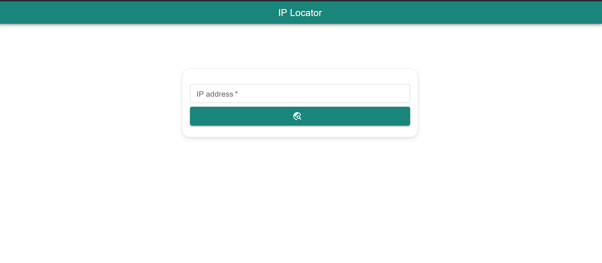

# Ip location

With the IP Location project, you can determine the location (country and city) based on the IP address.
To translate the IP address into a location, we need an external service called the "IP GEO lookup service" - it's free. 



[Material UI](https://mui.com/material-ui/getting-started/)

[React](https://react.dev/)

[Express.js](https://expressjs.com/de/)

---
Clone the project: [Ip-Location](https://github.com/Burnic1306/ip-location.git)
   

```bash
git clone https://github.com/Burnic1306/ip-location.git
```

## Starting Server 

1. Change to the project directory:
   ```bash
   cd server
   ```

2. Install the dependencies: 
     ```bash
   npm install 
   ```

3. Start the server with following command: 
   ```bash
   npm start
   ```
   **OR**
   ```bash
   PORT=9000 node bin/www
   ```
    
4. The server will now be started on port 9000. 

## Starting Client
1. Change to the project directory:
   ```bash
   cd client
   ```

2. Install the dependencies: 
     ```bash
   npm install 
   ```

3. Start the client with following command: 
   ```bash
   npm start
   ```
    
4. The client will now be started on port 3000. 
